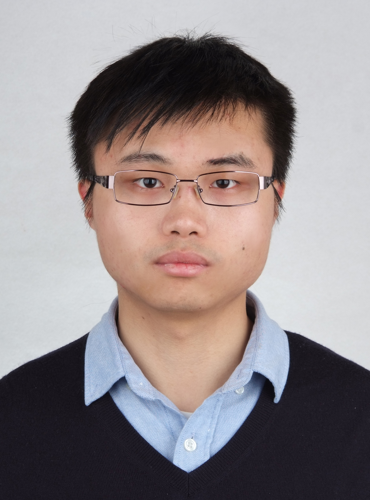

# Kan Zhong


&nbsp;

I am a graduated Ph.D student of Collecge of Computer Science, [Chongqing University](https://www.cqu.edu.cn/). I am lucky to work with my supervisor [Prof. Duo Liu](http://www.cs.cqu.edu.cn/info/1139/1329.htm). I was a visiting scholar of the Department of Electrical and Computer Engineering, [University of Florida](https://www.ece.ufl.edu/) from 2016 to 2017. During the stay in UFL, I joined [Intelligent Design of Efficient Architectures Laboratory (IDEAL)](http://www.ideal.ece.ufl.edu) and worked with [Prof. Tao Li](http://www.taoli.ece.ufl.edu/). Currently, I am a research enginieer in Huawei Inc.

## Research Interests
  * The application and software design of **emerging byte-addressable non-voatile memory**
  * High-performance and energy-efficient **mobile devices**
  * High-performance **storage systems**
  
  
## Slected Publications
### Conference Papers
  * **[HPCA'18]** *Mingcong Song, __Kan Zhong__, Jiaqi Zhang, Yang Hu, Duo Liu, Weigong Zhang, Jing Wang, and Tao Li,* **["In-situ AI: Towards Autonomous and Incremental Deep Learning for IoT Systems"](static/papers/In-situ_AI.pdf)**, in Proceedings of the 24th IEEE International Symposium on High Performance Computer Architecture (HPCA), pages 1562-1567, Feb. 24-28, 2018 Vienna, Austria. [[Lightning Talk]](https://www.youtube.com/watch?v=eKjfgcXZ7Ug)
  * **[DAC'17]** *Xiao Zhu, Duo Liu, __Kan Zhong__, Jinting Ren, and Tao Li,* **["SmartSwap: High-Performance and User Experience Friendly Swapping inMobile Systems"](static/papers/In-situ_AI.pdf)**, in Proceedings of the 54th Design Automation Conference (DAC), June 18-22, 2017, Austin, TX, USA.
  * **[DATE'16]** *__Kan Zhong__, Duo Liu, Liang Liang, Linbo Long, Yi Lin, Zili Shao,* **["FLIC: Fast, Lightweight Checkpointing for Mobile Virtualization using NVRAM"](static/papers/In-situ_AI.pdf)**, in Proceedings of the 2016 Design, Automation & Test in Europe Conference & Exhibition (DATE), pages 1562-1567, Mar. 14-18, 2016, Dresden, Germany.
  * **[HPCC'15]** *Xiao Zhu, Duo Liu, Liang Liang, __Kan Zhong__, Meikang Qiu, and Edwin H.-M. Sha,* **["Swap-Bench: The Easy Way to Demystify Swapping in Mobile Systems"](static/papers/In-situ_AI.pdf)**, in Proceedings of the 17th IEEE International Conference on High Performance Computing and Communications (HPCC), pages 497-502, Aug. 24-26, 2015, New York, USA.
  * **[DATE'15]** *__Kan Zhong__, Duo Liu, Linbo Long, Xiao Zhu, Weichen Liu, Qingfeng Zhuge, and Edwin H.-M. Sha,* **["_n_Code: Limiting Harmful Writes to Emerging Mobile NVRAM through Code Swapping"](static/papers/In-situ_AI.pdf)**, in Proceedings of the 2015 Design, Automation & Test in Europe Conference & Exhibition (DATE), pages 1305-1310,Mar. 9-13, 2015, Grenoble, France.
  * **[EMSOFT'14]** *__Kan Zhong__, Tianzheng Wang, Xiao Zhu, Linbo Long, Duo Liu, Weichen Liu, Zili Shao, and Edwin H.-M. Sha,* **["Building High-Performance Smartphones via Non-Volatile Memory: The Swap Approach"](static/papers/In-situ_AI.pdf)**, in Proceedings of the 14th International Conference on Embedded Software (EMSOFT), pages 30:1-30:10, Oct. 12-17, 2014, New Delhi, India.
  * **[ISLPED'14]** *__Kan Zhong__, Xiao Zhu, Tianzheng Wang, Dan Zhang, Xianlu Luo, Duo Liu, Weichen Liu, and Edwin H.-M. Sha,* **["DR. Swap: Energy-Efficient Paging for Smarthpones"](static/papers/In-situ_AI.pdf)**, in Proceedings of the 2014 International Symposiumon LowPower Electronics andDesign (ISLPED), pages 81-86, Aug. 11-13, 2014, La Jolla, California, USA.
  

### Journal Papers
  * **[TPDS'17]** *__Kan Zhong__, Duo Liu, Lingbo Long, Jinting Ren, Yang Li, and Edwin H.-M. Sha,* **["Building NVRAM-Aware Swapping Through CodeMigration inMobile Devices"](static/papers/In-situ_AI.pdf)**, IEEE Transactions on Parallel and Distributed Systems (TPDS), Vol. 28, No. 11, pp. 3089-3099, June 2017. (doi:10.1109/TPDS.2017.2713780)
  * **[TC'17]** *Duo Liu, __Kan Zhong__, Xiao Zhu, Yang Li, Lingbo Long, and Zili Shao,* **["Non-VolatileMemory Based Page Swapping for Building High-Performance Mobile Devices"](static/papers/In-situ_AI.pdf)**, IEEE Transactions on Computer (TC), Vol. 66,No. 11, pp. 1918-1931, June 2017. (doi:10.1109/TC.2017.2711620)
  * **[TPDS'16]** *Duo Liu, __Kan Zhong__, Tianzheng Wang, Yi Wang, Zili Shao, Edwin H.-M. Sha, and Jingling Xue,* **["Durable Address Translation in PCM-based Flash Storage Systems"](static/papers/In-situ_AI.pdf)**, IEEE Transactions on Parallel and Distributed Systems (TPDS), Vol. 28, No. 2, pp. 475-490, June 2016. (doi:10.1109/TPDS.2016.2586059)
  * **[TCAD'15]** *__Kan Zhong__, Duo Liu, Liang Liang, Xiao Zhu, Linbo Long, Yi Wang, and Edwin H.-M. Sha,* **["Energy-Efficient In-memory Paging for Smartphones"](static/papers/In-situ_AI.pdf)**, IEEE Transactions on Computer-Aided Design of Integrated Circuits and Systems (TCAD), Vol. 35, No. 10, pp. 1577-1590, Oct. 2015. (doi:10.1109/TCAD.2015.2512904)
  * **[TCAD'15]** *Linbo Long, Duo Liu, Liang Liang, Xiao Zhu, __Kan Zhong__, Zili Shao, and Edwin H.-M. Sha,**["Morphable ResistiveMemory Optimization forMobile Virtualization"](static/papers/In-situ_AI.pdf)**, IEEE Transactions on Computer-Aided Design of Integrated Circuits and Systems (TCAD), Vol. 35, No. 6, pp. 891-904, Oct. 2015. (doi:10.1109/TCAD.2015.2495264)
  * **[FGCS'16]** *Linbo Long, Edwin H.-M. Sha, Duo Liu, Liang Liang, __Kan Zhong__, and Xiao Zhu, **["A Compiler Assisted Wear Leveling for Morphable PCM in Embedded Systems"](static/papers/In-situ_AI.pdf)**, Future Generation Computer Systems, Vol. 71, pp. 32-43, Nov. 2016. (doi:10.1016/j.sysarc.2016.06.007)
  * **[FGCS'17]** *Xiao Zhu, Duo Liu, Liang Liang, __Kan Zhong__, Linbo Long, Meikang Qiu, Zili Shao, and Edwin H.-M. Sha,* **["Revisiting Swapping inMobile Systems with SwapBench"](static/papers/In-situ_AI.pdf)**, Future Generation Computer Systems, Vol. 74, pp. 265-275, Sep. 2017. (doi:10.1016/j.future.2016.05.026)
  



## Slected Publications
  * **[MICRO'18]** *Haiyu Mao, __Mingcong Song__, Tao Li, Yuting Dai, and Jiwu Shu,* **["LerGAN: A Zero-free, Low Data
Movement and PIM-based GAN Architecture"]()**, MICRO'18, to appear.
  * **[ISCA'18]** *__Mingcong Song__, Jiechen Zhao, Yang Hu, Jiaqi Zhang, and Tao Li,* **["Prediction based Execution on Deep Neural Networks"](static/papers/Prediction_AI.pdf)**, Proc. the 45th ACM/IEEE International Symposium on Computer Architecture (ISCA). [[Lightning Talk]](https://www.youtube.com/watch?v=YdczKwzn1eU)
  * **[ASPLOS'18]** *Yuting Dai, Tao Li, Benyong Liu, __Mingcong Song__, and Huixiang Chen* **[“Exploiting Dynamic Thermal Energy Harvesting for Reusing in Smartphone with Mobile Applications”]()**, Proc. of 23rd ACM International Conference on Architectural Support for Programming Languages and Oprating Systems (ASPLOS), Mar. 2018.
  * **[HPCA'18]** *__Mingcong Song__, Kan Zhong, Jiaqi Zhang, Yang Hu, Duo Liu, Weigong Zhang, Jing Wang, and Tao Li,* **["In-situ AI: Towards Autonomous and Incremental Deep Learning for IoT Systems"](static/papers/In-situ_AI.pdf)**, Proc. of the 24th IEEE International Symposium on High Performance Computer Architecture (HPCA), Feb. 2018. [[Lightning Talk]](https://www.youtube.com/watch?v=eKjfgcXZ7Ug)
  * **[HPCA'18]** *__Mingcong Song__, Jiaqi Zhang, Huixiang Chen, and Tao Li,* **["Towards Efficient Microarchitectural Design for Accelerating Unsupervised GAN-based Deep Learning"](static/papers/GAN.pdf)**, Proc. of the 24th IEEE International Symposium on High Performance Computer Architecture (HPCA), Feb. 2018. [[Lightning Talk]](https://www.youtube.com/watch?v=itVJW4qd5Yk)
  * [ISPASS'17] *Huixiang Chen, Yang Hu, Meng Wang, __Mingcong Song__, and Tao Li,* **["GaaS workload characterization under NUMA architecture for virtualized GPU"](http://ieeexplore.ieee.org/document/7975271/)**, Proc. of 2017 IEEE International Symposium on Performance Analysis of Systems and Software (ISPASS), Apr. 2017.
   * **[ASPLOS'17]** *Yang Hu, __Mingcong Song__, and Tao Li,* **[“Towards “Full Containerization” in Container Based Network Function Virtualization”](https://dl.acm.org/citation.cfm?id=3037713)**, Proc. of 22nd ACM International Conference on Architectural Support for Programming Languages and Operating Systems (ASPLOS), Apr. 2017.
   * **[HPCA'17]** *__Mingcong Song__, Yang Hu, Huixiang Chen, and Tao Li,* **["Towards Pervasive and User Satisfactory CNN across GPU Microarchitectures"](static/papers/P-CNN.pdf)**, Proc. of the 23rd IEEE International Symposium on High Performance Computer Architecture (HPCA), Feb. 2017. (**Best Paper Nomination**)
   * **[PACT'16]** *__Mingcong Song__, Yang Hu, Yunlong Xu, Chao Li, Huixiang Chen, Jingling Yuan, and Tao Li,* **["Bridging the Semantic Gaps of GPU Acceleration for Scale-out CNN-based Big Data Processing: Think Big, See Small"](static/papers/D3NN.pdf)**, Proc. of the 25th International Conference on Parallel Architectures and Compilation Techniques (PACT), Sep. 2016.
   * [ICS'16] *Yunlong Xu, Rui Wang, Tao Li, __Mingcong Song__, Lan Gao, Zhongzhi Luan, and Depei Qian,* **["Scheduling Tasks with Mixed Timing Constraints in GPU-Powered Real-Time Systems"](https://dl.acm.org/citation.cfm?id=2926265)**, Proc. the 30th International Conference on Supercomputing (ICS), Jun. 2016. 
   * **[ISCA'15]** *Chao Li, Yang Hu, Longjun Liu, Juncheng Gu, __Mingcong Song__, Jingling Yuan, Xiaoyao Liang, and Tao Li,* **["Towards Sustainable in-Situ Server Systems in the Big Data Era"](http://ieeexplore.ieee.org/document/7284052/)**, Proc. the 42nd ACM/IEEE International Symposium on Computer Architecture (ISCA), Jun. 2015.
  
## Awards and Honors
  * Travel Grant for 45th Int'l Symp. on ISCA, 2018
  * Travel Grant for 24th IEEE Symp. on HPCA, 2018
  * Travel Grant for 22nd ACM Int'l Conf. on ASPLOS, 2017
  * **Best Paper Nomination of HPCA 2017**, 2017
  * Travel Grant for 23rd IEEE Symp. on HPCA, 2017
  * Travel Grant for 25th Int'l Conf. on PACT, 2016
  * Travel Grant for 42th Int'l Symp. on ISCA, 2015
  * Outstanding International Student Award of University of Florida, 2015
  * Outstanding Academic Achievement of University of Florida, 2014
  * Excellent Student of University of Chinese Academy of Sciences, 2011
  * Outstanding Graduate in Huazhong University of Science and Technology, 2010
  * [First Prize in Texas Instruments DSP Contest](http://qiming.hust.edu.cn/info/1113/2585.htm), 2010 
  * [Grand Prize in Undergraduate Electronics Design Contest of Hubei Province](http://news.hust.edu.cn/_t6/2008/0930/c159a22343/page.htm), 2008

## Teaching Experience
  * **Teaching Assistant, University of Florida**
    * EEL 5934 Advanced Systems Programming, Spring 2017    
    * EEL 6935 Billion-Transistor Computer Architecture, Spring 2015
    * EEL 5764 Computer Architecture, Fall 2014

## Professional Services
  * **Conference Reviewer**:	HPCA, IPDPS, ICDCS, ICPP

